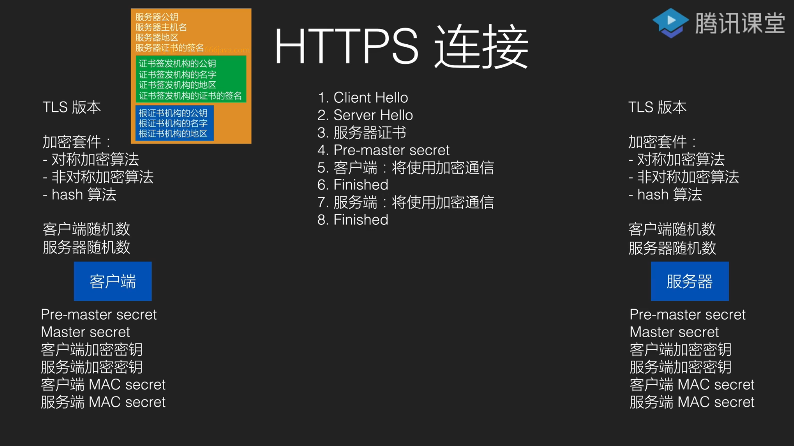

# HTTPS 
HTTP Secure/HTTP over SSL(Secure Socket Layer)/HTTP over TLS(Transport Layer Security)

在 http 层和 TCP 层下方加一层安全层，用于保障 HTTP 的加密传输

本质：在客户端和服务器之间使用非对称加密协商出一套对称加密密钥，每次发送信息之前将内容加密，收到之后解密，达到内容的加密传输

## HTTPS 连接 
* 客户端请求建立 TLS 连接
* 服务器发回证书
* 客户端验证服务器证书
* 客户端信任服务器后，和服务器协商对称密钥
* 使用对称密钥开始通信 

 